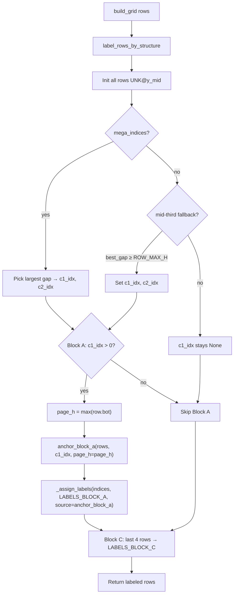

# Design D1: Hybrid Block A — `anchor_block_a()`

**Change:** `fase-2-fix-hybrid-tachon`  
**Deliverable:** D1 only (Block A anchoring fix)  
**Date:** 2026-06-22  
**Phase:** design-d1  
**Status:** Ready for tasks-d1  
**Authoritative spec:** `openspec/changes/fase-2-fix-hybrid-tachon/spec-d1-block-a.md`

---

## Executive summary

D1 extracts Block A index selection from `label_rows_by_structure()` into a dedicated `anchor_block_a()` function that applies a **ratio-scaled Y floor** before picking the first three compact pre-C1 rows. This fixes the dominant URNA=0 regression (43/55 cases) where spurious header rows at Y≈833–964 consumed Block A slots. **C1/C2 mega-gap logic and Block C last-4 assignment remain untouched.**

Work follows **strict TDD** (`openspec/config.yaml`): RED tests first → implementation → GREEN → `--validate` gate.

---

## Architecture

### Placement in labeling pipeline

`anchor_block_a()` is a **pure index selector** invoked only after C1/C2 indices are known. It does not mutate rows; the caller assigns labels via `_assign_labels()`.



### Module boundaries (D1)

| Component | File | D1 change |
|-----------|------|-----------|
| `anchor_block_a()` | `grid_detector_v2.py` | **NEW** — index selection only |
| `label_rows_by_structure()` | `grid_detector_v2.py` | **REFACTOR** — Block A delegation (L501–509) |
| `_assign_labels()` | `grid_detector_v2.py` | **EXTEND** — optional `label_source` param |
| C1/C2 mega-gap | `grid_detector_v2.py` | **UNCHANGED** |
| Block C last-4 | `grid_detector_v2.py` | **UNCHANGED** |
| `e14_worker.py` | — | **NO CHANGE** (API stable) |

### Design decision: separate function vs inline filter

| Option | Tradeoff |
|--------|----------|
| Inline Y-floor filter in `label_rows_by_structure` | Minimal diff; harder to unit-test in isolation |
| **Dedicated `anchor_block_a()`** | Testable RED matrix; clear Block A ownership; enables future ceiling/heuristics without touching C1/C2 |

**Choice:** Dedicated `anchor_block_a()` per spec REQ-D1-001.

### Design decision: `label_source` for Block A

| Option | Tradeoff |
|--------|----------|
| Keep `"structure"` for all rows | No test update; loses provenance |
| **`"anchor_block_a"` on Block A rows only** | Traceable in JSONL/debug; requires updating `test_good_pdf_nine_known_labels` assertion |

**Choice:** `"anchor_block_a"` on Block A rows (REQ-D1-009). Block B/C retain `"structure"`.

---

## Constants

### Table

| Constant | Value | Semantics |
|----------|-------|-----------|
| `BLOCK_A_Y_FLOOR` | `980` | Minimum `y_mid` (px) at reference page height |
| `BLOCK_A_REF_PAGE_H` | `3500` | Reference render height (300 DPI segunda-vuelta baseline) |
| `BLOCK_A_Y_FLOOR_RATIO` | `980 / 3500` ≈ `0.28` | Derived ratio for documentation; **not** a separate runtime constant unless desired for readability |
| `ROW_MIN_H` | `80` | Reused — compact row lower bound |
| `ROW_TYPICAL_MAX_H` | `120` | Reused — compact row upper bound (nivelación) |
| `SECTION_GAP_THRESHOLD` | `400` | Unchanged — C1/C2 mega-gap |
| `ROW_MAX_H` | `150` | Unchanged — mid-third fallback threshold |

### Ratio scaling formula (MUST)

```
y_floor_effective = int(page_h * BLOCK_A_Y_FLOOR / BLOCK_A_REF_PAGE_H)
```

Equivalent: `y_floor_effective = int(page_h * BLOCK_A_Y_FLOOR_RATIO)` when ratio is precomputed.

### `page_h` derivation

In `label_rows_by_structure()`:

```python
page_h = max(r["bot"] for r in labeled)
```

Uses maximum grid extent (bottom of lowest row), consistent with `process_h_lines(page_height=gray.shape[0])` scaling pattern.

### Worked examples

| `page_h` | `y_floor_effective` | Notes |
|----------|---------------------|-------|
| 3500 | 980 | Reference layout |
| 3869 | 1080 | Typical Antioquia validation PDF |
| 3890 | 1089 | Spec example |
| 3897 | 1091 | Upper bound of good PDF test |

### Edge cases

| Case | `y_mid` | `h` | Eligible? | Rationale |
|------|---------|-----|-----------|-----------|
| Spurious header row | 846 | 90 | **No** | Below floor on any scaled layout ≥3500 |
| Spurious header row | 946 | 90 | **No** | Below floor when `page_h ≥ 3380` |
| Real URNA (low band) | 1025 | 90 | **Yes** @ `page_h=3500` | Floor=980; must not over-filter (IT-D1-05) |
| Real URNA (typical) | 1149 | 90 | **Yes** | Gold mesa band |
| VOTANTES@840 (healthy 010) | 840 | 90 | **No** @ scaled floor | Acceptable — URNA@1147 still captured (IT-D1-04) |
| Tall spacer/header | 900 | 200 | **No** | Fails compact height check (UT-D1-04) |
| Spacer between INCINER–C1 | 1470 | 90 | **No** | `i ≥ c1_idx` or not among first 3 eligible |
| `c1_idx = 0` or `None` | — | — | **[]** | Caller skips Block A (UT-D1-01) |
| Fewer than 3 eligible rows | — | — | **1–2 indices** | Dynamic slot count per REQ-D1-004 |
| `y_floor` explicit in test | 980 | varies | Overrides scaling | UT-D1-02, UT-D1-03 |
| `page_h` and `y_floor` both None | — | — | **ValueError** | Fail fast in unit tests |

**Out of D1 scope:** `BLOCK_A_Y_CEILING` (~1300). Monitor via IT-D1-04/05; add only if batch regression.

---

## API and pseudocode

### New constants (insert after L418 `ROW_TYPICAL_MAX_H`)

```python
BLOCK_A_Y_FLOOR = 980
BLOCK_A_REF_PAGE_H = 3500
```

### Helper: effective Y floor

```python
def _effective_block_a_y_floor(
    *,
    y_floor: int | None = None,
    page_h: int | None = None,
) -> int:
    if y_floor is not None:
        return y_floor
    if page_h is not None:
        return int(page_h * BLOCK_A_Y_FLOOR / BLOCK_A_REF_PAGE_H)
    raise ValueError("anchor_block_a requires y_floor or page_h")
```

### `anchor_block_a()` signature

```python
def anchor_block_a(
    rows: list[dict],
    c1_idx: int,
    *,
    y_floor: int | None = None,
    page_h: int | None = None,
) -> list[int]:
    """Return up to 3 row indices for VOTANTES/URNA/INCINER before c1_idx."""
```

### Pseudocode

```python
def anchor_block_a(rows, c1_idx, *, y_floor=None, page_h=None) -> list[int]:
    if c1_idx is None or c1_idx <= 0:
        return []

    y_floor_effective = _effective_block_a_y_floor(y_floor=y_floor, page_h=page_h)

    eligible: list[int] = []
    for i in range(c1_idx):
        row = rows[i]
        h = row.get("height", row["bot"] - row["top"])
        y_mid = (row["top"] + row["bot"]) // 2
        if ROW_MIN_H <= h <= ROW_TYPICAL_MAX_H and y_mid >= y_floor_effective:
            eligible.append(i)

    return eligible[:3]
```

### `_assign_labels()` extension

```python
def _assign_labels(
    rows: list[dict],
    indices: list[int],
    labels: tuple[str, ...],
    *,
    label_source: str = "structure",
) -> None:
    for idx, label in zip(indices, labels):
        y_mid = (rows[idx]["top"] + rows[idx]["bot"]) // 2
        rows[idx]["label"] = label
        rows[idx]["y_mid"] = y_mid
        rows[idx]["label_source"] = label_source
```

### `label_rows_by_structure()` Block A hunk (replaces L501–509)

```python
    # Block A: up to 3 compact nivelación rows before C1 (Y-floor anchored).
    if c1_idx is not None and c1_idx > 0:
        page_h = max(r["bot"] for r in labeled)
        block_a_indices = anchor_block_a(labeled, c1_idx, page_h=page_h)
        _assign_labels(
            labeled,
            block_a_indices,
            LABELS_BLOCK_A,
            label_source="anchor_block_a",
        )
```

**Invariant:** Lines L474–499 (C1/C2) and L511–514 (Block C) remain byte-for-byte equivalent in logic.

---

## Diff plan

### `debug_sv/grid_detector_v2.py`

| Hunk | Location | Action | Est. LOC |
|------|----------|--------|----------|
| **H1** | After L418 (`ROW_TYPICAL_MAX_H`) | Add `BLOCK_A_Y_FLOOR`, `BLOCK_A_REF_PAGE_H` | +2 |
| **H2** | Before L446 (`label_rows_by_structure`) | Add `_effective_block_a_y_floor()`, `anchor_block_a()` | +35–45 |
| **H3** | L437–444 (`_assign_labels`) | Add optional `label_source` kwarg (default `"structure"`) | +3 |
| **H4** | L501–509 (Block A block) | Replace `pre_c1` loop with `anchor_block_a` + `_assign_labels(..., label_source="anchor_block_a")` | −8 / +7 net |

**Exports:** `anchor_block_a` should be importable from `test_row_labeling.py` for isolated unit tests.

### `debug_sv/test_row_labeling.py`

#### Import additions

```python
from debug_sv.grid_detector_v2 import (
    ...
    anchor_block_a,
    BLOCK_A_Y_FLOOR,
    BLOCK_A_REF_PAGE_H,
)
```

#### PDF fixtures (new constants)

```python
PDF_OFFSET = Path("data/pdfs_e14c_segunda/01_001_01_01_E14_PRE_01_001_001_01_01_003_5002.pdf")
PDF_HEALTHY_010 = Path("data/pdfs_e14c_segunda/01_001_01_01_E14_PRE_01_001_001_01_01_010_5002.pdf")
PDF_LOW_URNA_029 = Path("data/pdfs_e14c_segunda/01_001_01_01_E14_PRE_01_001_001_01_01_029_5002.pdf")
```

#### Helper (optional)

```python
def _y_mid(row: dict) -> int:
    return (row["top"] + row["bot"]) // 2

def _synthetic_compact_row(idx: int, y_mid: int, height: int = 90) -> dict:
    half = height // 2
    return {"row_idx": idx, "top": y_mid - half, "bot": y_mid + half, "height": height, "cells": []}
```

### Test additions — order (strict TDD RED → GREEN)

Tests **MUST** be committed in this order; each RED commit should fail against current `pre_c1[:3]` code.

| Order | Test ID | Function name | Phase | Expected on current code |
|-------|---------|---------------|-------|--------------------------|
| 1 | UT-D1-01 | `test_anchor_block_a_empty_when_c1_zero` | RED | PASS (already returns []) — still add for contract |
| 2 | UT-D1-02 | `test_anchor_block_a_y_floor_excludes_spurious_rows` | RED | **FAIL** — returns [0,1,2,3] not [2,3] |
| 3 | UT-D1-03 | `test_anchor_block_a_ratio_scaling` | RED | **FAIL** — function missing |
| 4 | UT-D1-04 | `test_anchor_block_a_skips_non_compact_rows` | RED | **FAIL** — non-compact included |
| 5 | IT-D1-01 | `test_offset_pdf_003_urna_at_nivelacion_band` | RED | **FAIL** — URNA at y≈946 |
| 6 | IT-D1-04 | `test_healthy_pdf_010_votantes_840_urna_1147` | RED | **FAIL** or borderline — URNA wrong |
| 7 | IT-D1-05 | `test_low_urna_pdf_029_urna_at_1025` | RED | **FAIL** — floor may exclude real row |

**GREEN phase:** Implement H1–H4; all above PASS.

**Regression (must stay green after GREEN):**

| Test ID | Function name | Notes |
|---------|---------------|-------|
| UT-D1-05 | `test_synthetic_spacer_gets_unk_at_1470` | Existing — no edit |
| UT-D1-06 | `test_bad_case_preserves_row_order` | Existing — no edit |
| IT-D1-02 | `test_good_pdf_nine_known_labels` | **UPDATE** label_source assertion (see below) |
| IT-D1-03 | `test_json_grid_structural_labels` | Existing — no edit |
| IT-D1-06 | `test_bad_pdf_finds_candidates_and_spacers` | Existing — no edit |

#### Test sketch details

**UT-D1-02:** Build 4 synthetic rows + C1 at index 4; `y_floor=980` explicit.

```python
rows = [
    _synthetic_compact_row(0, 846),
    _synthetic_compact_row(1, 946),
    _synthetic_compact_row(2, 1035),
    _synthetic_compact_row(3, 1152),
    _synthetic_compact_row(4, 1800),
]
assert anchor_block_a(rows, c1_idx=4, y_floor=980) == [2, 3]
```

**UT-D1-03:**

```python
assert int(3500 * BLOCK_A_Y_FLOOR / BLOCK_A_REF_PAGE_H) == 980
assert int(3890 * BLOCK_A_Y_FLOOR / BLOCK_A_REF_PAGE_H) == 1089
```

**IT-D1-01:** `URNA` y_mid in [1066, 1238]; assert no known label at y_mid in [866, 1026].

**IT-D1-04:** `URNA` y_mid ≈ 1147 (±80); `VOTANTES` may be absent or at y<1000 — no assertion on VOTANTES required.

**IT-D1-05:** `URNA` y_mid ≈ 1025 (±80).

#### Regression update: `test_good_pdf_nine_known_labels`

Replace blanket assertion:

```python
# OLD (L157-158):
for row in labeled:
    assert row["label_source"] == "structure"

# NEW:
BLOCK_A_LABELS = {"VOTANTES", "URNA", "INCINER"}
for row in labeled:
    if row["label"] in BLOCK_A_LABELS:
        assert row["label_source"] == "anchor_block_a"
    elif is_known_label(row["label"]):
        assert row["label_source"] == "structure"
```

---

## TDD workflow (mandatory)

```
┌─────────────────────────────────────────────────────────────┐
│ Phase 1 — RED                                               │
│   Commit A: UT-D1-01..04 (unit tests + imports)             │
│   Commit B: IT-D1-01, IT-D1-04, IT-D1-05 (integration)      │
│   Run: pytest debug_sv/test_row_labeling.py -v              │
│   Expect: new tests FAIL; existing 9 tests still PASS       │
├─────────────────────────────────────────────────────────────┤
│ Phase 2 — GREEN                                             │
│   Commit C: H1+H2 — constants + anchor_block_a()            │
│   Commit D: H3+H4 — _assign_labels kwarg + Block A delegate│
│   Commit E: Update test_good_pdf label_source assertion     │
│   Run: pytest debug_sv/test_row_labeling.py -v              │
│   Expect: all test_row_labeling PASS (16+ total w/ h_line)  │
├─────────────────────────────────────────────────────────────┤
│ Phase 3 — GATE                                              │
│   Commit F: --validate evidence (metrics snapshot in PR)    │
│   Run: analyze_e14_batch.py --validate                      │
│   Expect: OK% ≥ 24%, URNA=0 ≪ 55, arith_ok ≥ 24             │
└─────────────────────────────────────────────────────────────┘
```

**Rule:** No H1–H4 production code merged before Commit A+B RED tests exist and have been observed failing.

---

## PR plan — slice 1 (D1 only)

Single PR **PR-1-D1** targeting `main` (or integration branch). No D2 files.

| Commit | Message (conventional) | Contents |
|--------|------------------------|----------|
| 1 | `test(d1): add anchor_block_a unit tests (RED)` | UT-D1-01..04, imports, helpers |
| 2 | `test(d1): add offset/healthy/low-urna PDF tests (RED)` | IT-D1-01, IT-D1-04, IT-D1-05 |
| 3 | `feat(d1): add anchor_block_a with ratio-scaled Y floor` | H1, H2 |
| 4 | `refactor(d1): delegate Block A in label_rows_by_structure` | H3, H4 |
| 5 | `test(d1): assert anchor_block_a label_source on Block A rows` | `test_good_pdf_nine_known_labels` update |
| 6 | `chore(d1): validate batch metrics post-D1` | PR description / snapshot only — no code |

**PR title:** `fix(debug_sv): anchor Block A below Y floor (D1 hybrid tachon)`

**Review order:** `anchor_block_a()` logic → Block A hunk only → new tests → `--validate` metrics.

**Files in PR:**

- `debug_sv/grid_detector_v2.py`
- `debug_sv/test_row_labeling.py`
- `openspec/changes/fase-2-fix-hybrid-tachon/design-d1-block-a.md` (this artifact)

---

## Rollback strategy

Trigger rollback if **any** blocking gate fails after merge or pre-merge validation:

| Gate failure | Symptom |
|--------------|---------|
| GATE-D1-01 | OK% < 24% |
| GATE-D1-05 | Gold PDF 9/9 labels shifted |
| GATE-D1-04 | pytest regression |
| IT-D1-05 | URNA@1025 lost (floor too aggressive) |

### Rollback procedure

1. **Git revert** commits 3–5 (or full PR revert) restoring L501–509:

```python
    if c1_idx is not None and c1_idx > 0:
        pre_c1 = []
        for i in range(c1_idx):
            h = labeled[i].get("height", labeled[i]["bot"] - labeled[i]["top"])
            if ROW_MIN_H <= h <= ROW_TYPICAL_MAX_H:
                pre_c1.append(i)
        block_a = pre_c1[: len(LABELS_BLOCK_A)]
        _assign_labels(labeled, block_a, LABELS_BLOCK_A)
```

2. Remove `anchor_block_a()`, `_effective_block_a_y_floor()`, and `BLOCK_A_*` constants.
3. Revert `_assign_labels` `label_source` kwarg if unused elsewhere.
4. **Keep** new tests but mark offset tests `@pytest.mark.xfail(reason="rollback")` OR revert test commits — prefer full PR revert for cleanliness.
5. Re-run validation to confirm baseline restored (OK% ≈ 14%, known broken state).

### Partial mitigation (if only IT-D1-05 fails)

Before full rollback, try lowering floor reference (e.g. `BLOCK_A_Y_FLOOR = 960`) — **only** with spec amendment. Default action remains revert.

---

## Verification checklist

### Pre-merge (developer)

- [ ] RED commits exist; new tests observed failing before implementation
- [ ] `anchor_block_a()` returns `[]` when `c1_idx <= 0`
- [ ] Ratio formula matches UT-D1-03 for `page_h` 3500 and 3890
- [ ] Block A rows have `label_source == "anchor_block_a"`
- [ ] C1/C2 and Block C code paths unmodified (diff review)
- [ ] No edits under `src/modules/analyzer/`

### Automated gates

```powershell
Set-Location "D:\Nucleux\tools\Analizador de Elecciones"
python -m pytest debug_sv/test_row_labeling.py debug_sv/test_h_line_filter.py -v
python debug_sv/analyze_e14_batch.py --validate
```

| Check | Target | Source |
|-------|--------|--------|
| pytest | ≥ 16 PASS | `test_row_labeling` + `test_h_line_filter` |
| OK% | ≥ 24% | `e14c_validate_complete.json` |
| URNA=0 | ≪ 55 (~12 residual) | validation JSONL |
| arith_ok | ≥ 24 | validation JSONL |
| Gold 001 | 9/9 labels ±80 px | `test_good_pdf_nine_known_labels` |
| Offset 003 | URNA y≈1150 | `test_offset_pdf_003_urna_at_nivelacion_band` |

### Post-merge (operator)

- [ ] Document residual URNA=0 categories (mega-gap 10, other 2) in PR notes
- [ ] Engram topic `sdd/fase-2-fix-hybrid-tachon/design-d1` updated with gate metrics
- [ ] Unblock tasks-d2 only after D1 gates PASS

---

## Risks and mitigations

| Risk | Severity | Mitigation in implementation |
|------|----------|------------------------------|
| Y floor too rigid nationally | High | Ratio scaling; 100-PDF `--validate` |
| Floor drops URNA@1025 | Medium | IT-D1-05 blocking |
| Healthy 010 URNA regression | Medium | IT-D1-04 blocking |
| Unit pass, batch fail | High | Mandatory GATE-D1-01 |
| `label_source` breaks consumers | Low | Additive value; no `e14_worker` change |
| 10 mega-gap cases still URNA=0 | Medium | Documented non-goal |

---

## Out of scope (explicit)

- D2: `field_groups`, `tachon_summary`, `analyze_cell`
- `e14_worker.py`, `candidate_subcells.py` edits
- `BLOCK_A_Y_CEILING` unless regression observed
- Mega-gap-not-detected PDFs (10)
- Batch 90K execution

---

## Next step

**tasks-d1:** Break this design into session-sized apply tasks with RED/GREEN/GATE checkpoints per commit table above.