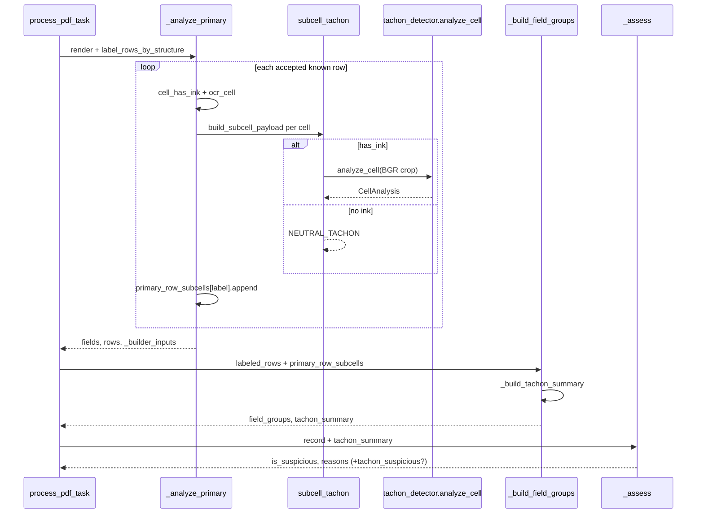
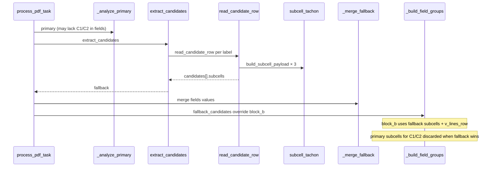

# Design D2: field_groups + per-subcell tachon

**Change:** `fase-2-fix-hybrid-tachon`  
**Deliverable:** D2 (field_groups + tachon enrichment)  
**Date:** 2026-06-22  
**Phase:** design  
**Depends on:** D1 merged (`anchor_block_a` — correct row→label map)  
**Authoritative spec:** `spec-d2-field-groups-tachon.md`  
**Strict TDD:** `debug_sv/test_tachon_field_groups.py` RED before any implementation

---

## 1. Executive summary

D2 adds two additive JSONL keys — `field_groups` and `tachon_summary` — to the segunda-vuelta worker without changing flat `fields` / `rows` semantics. Per-digit subcells gain OCR metadata plus `analyze_cell()` scores from `src/modules/analyzer/tachon_detector.py` (import only).

**Architecture choice:** Keep orchestration in `e14_worker.py`; extract tachon crop logic into a small shared module `debug_sv/subcell_tachon.py` to avoid duplicating pad/crop/neutral-tachon rules between primary and fallback paths. Field-group assembly stays in `e14_worker._build_field_groups()` with a pure `_build_tachon_summary()` helper in the same file.

**Merge gate:** PR-2 lands only after D1 PR-1 is merged and `--validate` baseline is frozen.

---

## 2. Module architecture

### 2.1 Component map

```
debug_sv/
├── subcell_tachon.py          # NEW — shared tachon enrichment (REQ-D2-010/013)
├── e14_worker.py              # MOD — primary tachon, _build_field_groups, assess
├── candidate_subcells.py      # MOD — read_candidate_row subcells + tachon
└── test_tachon_field_groups.py # NEW — strict TDD (RED first)
```

| Module | Responsibility |
|--------|----------------|
| `subcell_tachon.py` | `NEUTRAL_TACHON`, `enrich_subcell_tachon()`, `build_subcell_payload()` |
| `e14_worker._analyze_primary` | OCR loop + collect `primary_row_subcells`; return `_builder_inputs` (internal, not JSONL) |
| `candidate_subcells.read_candidate_row` | Per-cell OCR + `subcells[]` with tachon (REQ-D2-011) |
| `e14_worker._build_field_groups` | Route labels → blocks; fallback override for Block B |
| `e14_worker._build_tachon_summary` | Aggregate counts/flags from assembled `field_groups` |
| `e14_worker.process_pdf_task` | Wire builder after fallback merge; strip `_builder_inputs` |
| `e14_worker._assess` | Append `tachon_suspicious` when `suspicious_subcells > 0` |

**Not in D2:** `grid_detector_v2.anchor_block_a()` implementation, any edit under `src/modules/analyzer/`.

### 2.2 Label constants (import, do not duplicate)

```python
from debug_sv.grid_detector_v2 import (
    LABELS_BLOCK_A,
    LABELS_BLOCK_B,
    LABELS_BLOCK_C,
    CELL_PAD,
    is_known_label,
)
```

### 2.3 `label_source` routing

| Block | Labels | `label_source` value | Notes |
|-------|--------|----------------------|-------|
| `block_a` | VOTANTES, URNA, INCINER | `"anchor_block_a"` | Requires D1; tests mock `labeled_rows` until D1 lands |
| `block_b` | C1_CEPEDA, C2_ABELARDO | `"structure"` | Fallback entries add `v_lines_row` |
| `block_c` | BLANCO, NULOS, NO_MARCADOS, SUMA_TOTAL | `"structure"` | |

`label_source` is copied from each `labeled_rows[i]["label_source"]` when present; pre-D1 tests inject `"anchor_block_a"` on Block A mocks. Post-D1, `label_rows_by_structure` must emit this field on anchored rows (D1 scope).

### 2.4 Tachon wiring

```
                    ┌─────────────────────────────────────┐
                    │     subcell_tachon.enrich_subcell   │
                    │  crop_cell(img, cell, CELL_PAD)     │
                    │  has_ink ? analyze_cell(crop)       │
                    │           : NEUTRAL_TACHON          │
                    └──────────────┬──────────────────────┘
                                   │
              ┌────────────────────┼────────────────────┐
              ▼                    ▼                    ▼
   e14_worker._analyze_primary   read_candidate_row   (tests patch
   per accepted known row        per C1/C2 cell       analyze_cell)
```

**Primary path:** For each accepted row with `is_known_label(label)`, build up to 3 subcell dicts during the existing OCR loop (L93–102). Store in `primary_row_subcells[label]`.

**Fallback path:** `read_candidate_row` builds `subcells` inline using the same `enrich_subcell_tachon`. Worker does **not** re-run tachon on C1/C2 when `fallback_candidates[].subcells` already exist (REQ-D2-012 mitigation #2).

**UNK@* exclusion:** Rows whose label starts with `UNK@` never enter `primary_row_subcells` and never appear in `field_groups` (REQ-D2-015).

---

## 3. Function signatures

### 3.1 `debug_sv/subcell_tachon.py` (new)

```python
from __future__ import annotations

import numpy as np

from debug_sv.candidate_subcells import crop_cell
from debug_sv.grid_detector_v2 import CELL_PAD
from src.modules.analyzer.tachon_detector import analyze_cell

NEUTRAL_TACHON: dict = {
    "score": 0.0,
    "tachon_score": 0.0,
    "density_score": 0.0,
    "noise_score": 0.0,
    "flags": [],
    "is_suspicious": False,
}


def enrich_subcell_tachon(
    img: np.ndarray,
    cell: dict,
    *,
    has_ink: bool,
    pad: int = CELL_PAD,
) -> dict:
    """
    Return CellAnalysis.to_dict() for inked cells; NEUTRAL_TACHON otherwise.
    Does not call analyze_cell when has_ink is False (REQ-D2-013).
    Crop geometry matches ocr_cell: img[y1+pad:y2-pad, x1+pad:x2-pad].
    """


def build_subcell_payload(
    cell: dict,
    *,
    digit: str,
    confidence: float,
    has_ink: bool,
    img: np.ndarray,
    pad: int = CELL_PAD,
) -> dict:
    """
    Full Subcell schema: idx, x1..y2, digit, confidence, has_ink, tachon.
    Single call site helper for primary and fallback loops.
    """
```

### 3.2 `debug_sv/e14_worker.py` (modified)

```python
def _analyze_primary(pdf: Path) -> dict:
    """
    Existing return keys unchanged for JSONL consumers.
    Adds internal-only:
      "_builder_inputs": {
          "labeled_rows": list[dict],
          "primary_row_subcells": dict[str, list[dict]],
      }
    """


def _build_field_groups(
    *,
    labeled_rows: list[dict],
    primary_row_subcells: dict[str, list[dict]],
    fallback_candidates: list[dict] | None,
    flat_fields: dict[str, int | None],
) -> tuple[dict, dict | None]:
    """
    Assemble field_groups from labeled row metadata + subcell payloads.
    Returns (field_groups, tachon_summary | None).
    tachon_summary is None when analyzed_subcells == 0 (omit key — REQ-D2-006).
    """


def _build_tachon_summary(field_groups: dict) -> dict | None:
    """
    Walk all blocks' fields[*].subcells[*].tachon.
    Returns {
        "analyzed_subcells": int,
        "suspicious_subcells": int,
        "flags_by_label": dict[str, list[str]],  # sorted unique flags
    } or None if analyzed_subcells == 0.
    """


def _assess(record: dict) -> tuple[bool, list[str]]:
    """
    Existing arithmetic / missing-field logic unchanged.
    After dedupe, if tachon_summary.suspicious_subcells > 0:
        append "tachon_suspicious" once (REQ-D2-020).
    is_suspicious remains driven by is_critical predicate only (REQ-D2-021).
    """
```

### 3.3 `debug_sv/candidate_subcells.py` (modified)

```python
def read_candidate_row(
    gray: np.ndarray,
    img: np.ndarray,
    row: dict,
    label: str,
    v_global: list[int],
    engine,
    pad: int,
    out_dir: Path | None = None,
) -> dict:
    """
    Extended return (additive keys):
      "subcells": list[dict]   # length 3, full Subcell schema
    Existing keys unchanged: label, y_top, y_bot, v_lines_row, digits,
    confidences, value, ink, crops.
    """
```

### 3.4 Internal builder input shape

```python
# _analyze_primary → _builder_inputs
{
    "labeled_rows": [
        {
            "label": "URNA",
            "y_mid": 1149,
            "top": 1105,      # or y_top — normalize in builder
            "bot": 1193,      # or y_bot
            "label_source": "anchor_block_a",  # post-D1
            "cells": [{"x1": ..., "y1": ..., "x2": ..., "y2": ...}, ...],
        },
        ...
    ],
    "primary_row_subcells": {
        "URNA": [subcell_dict, subcell_dict, subcell_dict],
        "C1_CEPEDA": [...],
    },
}
```

`_build_field_groups` normalizes `top`/`bot` vs `y_top`/`y_bot` from `labeled_rows` and `fallback_candidates`.

---

## 4. Sequence diagrams

### 4.1 Primary path (C1 + C2 present — no fallback)



### 4.2 Fallback path (C1 or C2 missing)



**Override rule:** For each label in `LABELS_BLOCK_B`, if `fallback_candidates` contains an entry with that `label`, `field_groups.block_b.fields[label]` is built exclusively from the candidate dict (`subcells`, `v_lines_row`, `value`, `y_top`/`y_bot`). Primary-path subcells for that label are ignored.

---

## 5. JSON schema examples

### 5.1 Minimal successful record (primary only, sparse blocks)

Illustrates additive keys; flat `fields` / `rows` unchanged.

```json
{
  "pdf": "data/pdfs_e14c_segunda/01_001_01_01_E14_PRE_01_001_001_01_01_001_5002.pdf",
  "dept": "01",
  "method": "primary",
  "fallback_triggered": false,
  "fields": {
    "VOTANTES": 1023,
    "URNA": 1149,
    "INCINER": 1268,
    "C1_CEPEDA": 44,
    "C2_ABELARDO": 12,
    "BLANCO": 0,
    "NULOS": 1,
    "NO_MARCADOS": 0,
    "SUMA_TOTAL": 57
  },
  "rows": [
    {
      "label": "URNA",
      "value": 1149,
      "digits": ["1", "1", "4"],
      "confidences": [0.994, 1.0, 1.0],
      "y_mid": 1149
    }
  ],
  "field_groups": {
    "block_a": {
      "labels": ["VOTANTES", "URNA", "INCINER"],
      "fields": {
        "VOTANTES": {
          "value": 1023,
          "y_mid": 1023,
          "y_top": 978,
          "y_bot": 1068,
          "label_source": "anchor_block_a",
          "subcells": []
        },
        "URNA": {
          "value": 1149,
          "y_mid": 1149,
          "y_top": 1105,
          "y_bot": 1193,
          "label_source": "anchor_block_a",
          "subcells": [
            {
              "idx": 0,
              "x1": 905, "y1": 1105, "x2": 998, "y2": 1193,
              "digit": "1",
              "confidence": 0.994,
              "has_ink": true,
              "tachon": {
                "score": 0.12,
                "tachon_score": 0.05,
                "density_score": 0.0,
                "noise_score": 0.0,
                "flags": [],
                "is_suspicious": false
              }
            }
          ]
        }
      }
    },
    "block_b": {
      "labels": ["C1_CEPEDA", "C2_ABELARDO"],
      "fields": {}
    },
    "block_c": {
      "labels": ["BLANCO", "NULOS", "NO_MARCADOS", "SUMA_TOTAL"],
      "fields": {}
    }
  },
  "tachon_summary": {
    "analyzed_subcells": 18,
    "suspicious_subcells": 0,
    "flags_by_label": {}
  },
  "is_suspicious": false,
  "suspicious_reasons": []
}
```

**Invariant:** For every label `L` in `fields` with non-null value, `field_groups.*.fields[L].value === fields[L]`.

**Omission policy:** When all subcells are empty (no ink), omit `tachon_summary` entirely.

### 5.2 C1 with tachon flags (primary+fallback)

```json
{
  "method": "primary+fallback",
  "fallback_triggered": true,
  "fields": {
    "URNA": 127,
    "C1_CEPEDA": 53,
    "C2_ABELARDO": 71
  },
  "fallback_candidates": [
    {
      "label": "C1_CEPEDA",
      "value": 53,
      "v_lines_row": [905, 998, 1091, 1187],
      "subcells": [
        {
          "idx": 1,
          "x1": 998, "y1": 1750, "x2": 1091, "y2": 1842,
          "digit": "5",
          "confidence": 1.0,
          "has_ink": true,
          "tachon": {
            "score": 0.62,
            "tachon_score": 0.58,
            "density_score": 0.41,
            "noise_score": 0.12,
            "flags": ["TACHON", "DENSIDAD_ALTA"],
            "is_suspicious": true
          }
        }
      ]
    }
  ],
  "field_groups": {
    "block_a": {
      "labels": ["VOTANTES", "URNA", "INCINER"],
      "fields": {
        "URNA": {
          "value": 127,
          "y_mid": 1152,
          "y_top": 1108,
          "y_bot": 1196,
          "label_source": "anchor_block_a",
          "subcells": []
        }
      }
    },
    "block_b": {
      "labels": ["C1_CEPEDA", "C2_ABELARDO"],
      "fields": {
        "C1_CEPEDA": {
          "value": 53,
          "y_mid": 1796,
          "y_top": 1750,
          "y_bot": 1842,
          "label_source": "structure",
          "v_lines_row": [905, 998, 1091, 1187],
          "subcells": [
            {
              "idx": 0,
              "digit": "0",
              "confidence": 0.0,
              "has_ink": false,
              "tachon": {
                "score": 0.0,
                "tachon_score": 0.0,
                "density_score": 0.0,
                "noise_score": 0.0,
                "flags": [],
                "is_suspicious": false
              }
            },
            {
              "idx": 1,
              "digit": "5",
              "confidence": 1.0,
              "has_ink": true,
              "tachon": {
                "score": 0.62,
                "tachon_score": 0.58,
                "density_score": 0.41,
                "noise_score": 0.12,
                "flags": ["TACHON", "DENSIDAD_ALTA"],
                "is_suspicious": true
              }
            }
          ]
        }
      }
    },
    "block_c": {
      "labels": ["BLANCO", "NULOS", "NO_MARCADOS", "SUMA_TOTAL"],
      "fields": {}
    }
  },
  "tachon_summary": {
    "analyzed_subcells": 4,
    "suspicious_subcells": 1,
    "flags_by_label": {
      "C1_CEPEDA": ["DENSIDAD_ALTA", "TACHON"]
    }
  },
  "is_suspicious": true,
  "suspicious_reasons": [
    "missing_votantes",
    "missing_inciner",
    "used_candidate_fallback",
    "tachon_suspicious"
  ]
}
```

Note: `is_suspicious` is `true` here due to `missing_*` (arithmetic authority), not tachon alone. Tachon only adds `tachon_suspicious` to `suspicious_reasons`.

---

## 6. `_assess()` integration

### 6.1 Existing behavior (unchanged)

| Condition | `suspicious_reasons` | Affects `is_suspicious` |
|-----------|---------------------|-------------------------|
| Missing C1/C2/URNA | `missing_*` | **Yes** (`is_critical`) |
| `rows_accepted < 7` | `few_rows` | No |
| Vote sum ≠ URNA | `arithmetic_mismatch(...)` | **Yes** |
| Fallback used | `used_candidate_fallback` | No |
| Low conf candidate | `low_confidence_candidate` | No |

### 6.2 D2 additive rule

```python
ts = record.get("tachon_summary")
if ts and ts.get("suspicious_subcells", 0) > 0:
    reasons.append("tachon_suspicious")
```

| Rule | Behavior |
|------|----------|
| REQ-D2-020 | Append `"tachon_suspicious"` once per record when any subcell `is_suspicious` |
| REQ-D2-021 | Do **not** set `is_critical` from tachon; arithmetic/missing rules remain authoritative |
| REQ-D2-022 | Detail lives in `tachon_summary.flags_by_label`, not duplicated in reasons |

**Test contract (T-D2-M05):** Mock arithmetic-OK record with one suspicious subcell → `tachon_suspicious` in reasons, `is_suspicious is False`.

---

## 7. Performance

### 7.1 Cost model (per spec §8)

| Parameter | Value |
|-----------|-------|
| Calls per PDF | Up to `3 × N` where N = accepted known rows (≤9) + up to 2 fallback rows |
| Crop size | ~60×80 px after `CELL_PAD=8` |
| Per-call cost | OpenCV morphology, sub-ms to low-ms |

### 7.2 D2 mitigations (no lazy/deferred tachon)

| Strategy | Decision |
|----------|----------|
| **Lazy tachon** | **No** — run synchronously during OCR loop; latency acceptable on 100-PDF validate set |
| **Batch only known labels** | **Yes** — tachon only on `is_known_label(label)` accepted rows + C1/C2 fallback |
| **Skip empty cells** | **Yes** — `has_ink=false` → `NEUTRAL_TACHON`, no `analyze_cell()` |
| **No double tachon on C1/C2** | **Yes** — fallback `subcells` win; primary block_b subcells discarded |
| **No JSONL bloat from internals** | **Yes** — strip `_builder_inputs`; no raw crop bytes |

### 7.3 Out of scope

90K batch optimization (skip Block A/C tachon, parallel pool) deferred to a future change.

---

## 8. Test file structure (`test_tachon_field_groups.py`)

**TDD order:** Create entire test module first; confirm RED (`pytest` failures) before touching production code.

### 8.1 File layout

```python
# debug_sv/test_tachon_field_groups.py

"""D2: field_groups schema + tachon enrichment (strict TDD)."""

# --- fixtures (module scope) ---
# MOCK_LABELED_ROWS, MOCK_IMG (32×32 BGR), NEUTRAL_TACHON expectations
# PDF_GOOD = 01_01_001_5002, PDF_OFFSET = 01_01_003_5002

# --- helpers ---
# run_worker_mocked(pdf) -> dict          # patch analyze_cell, optional PDF
# assert_subcell_schema(subcell) -> None
# assert_field_groups_invariant(record) -> None

class TestFieldGroupsSchema:        # T-D2-S01..S05
class TestTachonMocked:             # T-D2-M01..M05
class TestCandidateSubcells:        # T-D2-C01..C04
class TestEmptyCellPolicy:          # T-D2-E01..E03
class TestRegressionGuards:         # T-D2-R01..R02
```

### 8.2 Patch targets

| Test | Patch path |
|------|------------|
| M01–M04 | `src.modules.analyzer.tachon_detector.analyze_cell` |
| Worker integration | `debug_sv.e14_worker.process_pdf_task` or `_analyze_primary` via importlib worker module |
| C01 | `debug_sv.candidate_subcells.read_candidate_row` (direct call with synthetic row) |

### 8.3 Key fixtures

```python
@pytest.fixture
def mock_analyze_cell():
    """Return CellAnalysis-like mock; track call count and crop shapes."""

@pytest.fixture
def synthetic_labeled_rows():
    """3 Block A + 2 Block B + 4 Block C rows with label_source."""

def make_cell_analysis(score=0.0, flags=None, is_suspicious=False):
    """Factory matching CellAnalysis.to_dict() shape."""
```

### 8.4 RED-phase expectations

| Test ID | Pre-D2 failure mode |
|---------|---------------------|
| S01 | `KeyError: 'field_groups'` on worker output |
| M01 | `analyze_cell` never called from worker |
| C01 | `read_candidate_row` return lacks `subcells` |
| M05 | `tachon_suspicious` not in reasons |
| E03 | `tachon_summary` present when it should be omitted |

### 8.5 Validation commands

```powershell
Set-Location "D:\Nucleux\tools\Analizador de Elecciones"

# RED then GREEN
python -m pytest debug_sv/test_tachon_field_groups.py -v

# Regression (must stay green)
python -m pytest debug_sv/test_row_labeling.py debug_sv/test_h_line_filter.py -v

# D1 metrics gate (post-D1 baseline)
python debug_sv/analyze_e14_batch.py --validate
```

---

## 9. PR-2 plan (slice 2 — depends on D1 merged)

### 9.1 PR metadata

| Field | Value |
|-------|-------|
| **PR** | PR-2 (D2) |
| **Base branch** | `main` with D1 (`anchor_block_a`) merged |
| **Blocks** | D1 must be merged; do not implement `anchor_block_a` in this PR |

### 9.2 File diff list

| File | Action | Est. LOC | Description |
|------|--------|----------|-------------|
| `debug_sv/test_tachon_field_groups.py` | **Create** | ~280 | All T-D2-* cases; committed RED before impl |
| `debug_sv/subcell_tachon.py` | **Create** | ~55 | `NEUTRAL_TACHON`, `enrich_subcell_tachon`, `build_subcell_payload` |
| `debug_sv/e14_worker.py` | **Modify** | ~120 | Primary tachon loop, `_builder_inputs`, `_build_field_groups`, `_build_tachon_summary`, `process_pdf_task` wire, `_assess` extension |
| `debug_sv/candidate_subcells.py` | **Modify** | ~40 | `read_candidate_row` → `subcells[]` with tachon |
| `debug_sv/analyze_e14_batch.py` | Optional | ~5 | Docstring note: stats ignore `field_groups` |
| `openspec/changes/fase-2-fix-hybrid-tachon/design-d2-field-groups-tachon.md` | **Create** | — | This artifact |
| `src/modules/analyzer/tachon_detector.py` | **No edit** | 0 | Import only |

**Total estimate:** ~350–500 LOC (tests + impl).

### 9.3 Review order

1. Schema contract + JSON examples (§5)
2. `subcell_tachon` crop pad alignment (T-D2-M02)
3. Fallback override for Block B (T-D2-C03)
4. `_assess` additive behavior (T-D2-M05)
5. Flat `fields` / `rows` unchanged (T-D2-S03, S04)
6. `--validate` no regression vs post-D1 snapshot

### 9.4 Commit sequence (recommended)

```
1. test: add test_tachon_field_groups.py (RED)
2. feat: add subcell_tachon shared helper
3. feat: tachon in read_candidate_row + subcells schema
4. feat: primary loop tachon + _builder_inputs
5. feat: _build_field_groups + _build_tachon_summary
6. feat: process_pdf_task wire + _assess tachon_suspicious
7. chore: validate green + batch --validate
```

---

## 10. Risks

| Risk | Severity | Mitigation |
|------|----------|------------|
| D1 not merged — wrong Block A Y bands | **High** | Hard merge gate; T-D2-R02 asserts `anchor_block_a` source post-D1 |
| `candidate_subcells` raw h_lines desync | **Medium** | Document Fase 1b; fallback+tachon triage is best-effort until fixed |
| Circular import e14_worker ↔ candidate_subcells | **Medium** | New `subcell_tachon.py` imports `crop_cell` only from candidate_subcells |
| High-recall tachon noise | **Medium** | `tachon_summary` for triage; no auto-reject (REQ-D2-021) |
| JSONL size growth | **Low** | Monitor &lt;2× per record; omit `tachon_summary` when zero analysis |
| Test patch path drift | **Low** | Patch `src.modules.analyzer.tachon_detector.analyze_cell` at source |

---

## 11. Implementation checklist (tasks-d2)

- [ ] **RED:** Create `test_tachon_field_groups.py` with all T-D2-* cases; verify failures
- [ ] Create `debug_sv/subcell_tachon.py`
- [ ] Extend `read_candidate_row` with `subcells[]`
- [ ] Extend `_analyze_primary` with tachon + `_builder_inputs`
- [ ] Implement `_build_field_groups` + `_build_tachon_summary`
- [ ] Wire `process_pdf_task`; strip internal keys
- [ ] Extend `_assess` with `tachon_suspicious`
- [ ] **GREEN:** All D2 tests pass
- [ ] Run `--validate`; confirm D1 metrics unchanged

---

## 12. References

| Artifact | Role |
|----------|------|
| `spec-d2-field-groups-tachon.md` | Authoritative requirements |
| `proposal.md` | R-SUS-1..5, delivery plan |
| `exploration.md` | Insertion points §3 |
| `debug_sv/e14_worker.py` | Current worker (L61–218) |
| `debug_sv/candidate_subcells.py` | `read_candidate_row` (L184–263) |
| `src/modules/analyzer/tachon_detector.py` | `analyze_cell`, `CellAnalysis.to_dict()` |

---

## Next step

**tasks-d2:** Break checklist §11 into ordered implementation tasks; start with RED test file.