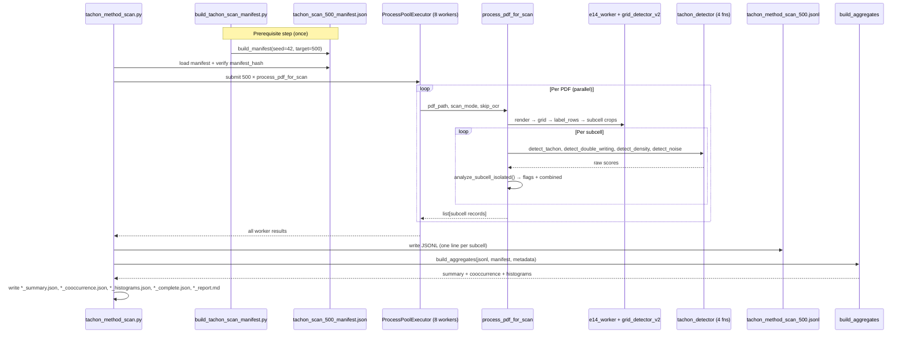

# Design: Tachon Pattern Scan — 500 PDFs × Per-Method Isolation

**Change:** `tachon-pattern-scan-500pdf`  
**Date:** 2026-06-22  
**Status:** Design — ready for `sdd-spec` / `sdd-tasks`

---

## Context

The D2 validate run (100 PDFs, dept `01` only) proved that combined `analyze_cell()` weighting masks per-method behavior: isolated TACHON flags **~93% of ink subcells** while the combined score flags only **144**. A nationally representative 500-PDF experiment with per-method isolation is required before any production threshold tuning.

**Constraints (user decisions):**
- Stratified 500 PDFs by department (33 depts, seed=42)
- Per-method isolated detector runs (Approach A from exploration)
- Single PR, `debug_sv/` only — **no edits** to `src/modules/analyzer/tachon_detector.py`
- D2 worker files are a **prerequisite** (currently missing from workspace; restore from PR #1)

---

## Architecture

Three self-contained modules under `debug_sv/`, plus generated artifacts under `data/analysis_segunda_vuelta/`.

```
┌─────────────────────────────────────────────────────────────────────────┐
│                     tachon-pattern-scan-500pdf                          │
├─────────────────────────────────────────────────────────────────────────┤
│  build_tachon_scan_manifest.py   │  tachon_method_scan.py               │
│  ─────────────────────────────   │  ────────────────────────            │
│  • Corpus scan (90,838 PDFs)     │  • Manifest loader                   │
│  • Stratified allocation       │  • Multiprocess PDF workers          │
│  • SHA256 manifest hash        │  • D2 grid/subcell extraction        │
│  • validate_holdout tagging    │  • Isolated detector scoring         │
│                                  │  • JSONL writer (append-safe)        │
│           │                      │           │                          │
│           ▼                      │           ▼                          │
│  tachon_scan_500_manifest.json   │  tachon_method_scan_500.jsonl        │
│                                  │           │                          │
│                                  │           ▼                          │
│                                  │  build_aggregates() (same module)    │
│                                  │  • summary / cooccurrence / hist     │
│                                  │  • completion metadata + MD report   │
└─────────────────────────────────────────────────────────────────────────┘
```

### Module map

| Module | File | Responsibility |
|--------|------|----------------|
| **Manifest builder** | `debug_sv/build_tachon_scan_manifest.py` | Scan corpus, stratified sample, write locked manifest |
| **Scan runner** | `debug_sv/tachon_method_scan.py` | Load manifest, parallel PDF processing, flat JSONL output |
| **Aggregate reporter** | `debug_sv/tachon_method_scan.py` (`build_aggregates`) | Post-scan stats: rates, histograms, co-occurrence, MD report |

### External dependencies (read-only imports)

| Dependency | Path | Usage |
|------------|------|-------|
| Detectors | `src/modules/analyzer/tachon_detector.py` | `detect_tachon`, `detect_double_writing`, `detect_density`, `detect_noise` |
| D2 worker (prerequisite) | `debug_sv/e14_worker.py` | `process_pdf_task` or `_extract_subcells_for_scan` |
| Grid pipeline | `debug_sv/grid_detector_v2.py` | H-line filter, grid rows, label_rows |
| Subcell helpers | `debug_sv/subcell_tachon.py` | `has_ink` detection, crop padding, `_json_safe_tachon` |
| Corpus | `data/pdfs_e14c_segunda/` | 90,838 PDFs, read-only |
| Validate baseline | `data/analysis_segunda_vuelta/e14c_validate_results.jsonl` | `validate_holdout` tagging only |

---

## Core Function Signatures

### Manifest builder (`build_tachon_scan_manifest.py`)

```python
from pathlib import Path
from typing import TypedDict

class ManifestEntry(TypedDict):
    pdf: str
    dept: str
    stratum: str
    validate_holdout: bool

class Manifest(TypedDict):
    seed: int
    total_pdfs: int
    total_corpus: int
    departments: int
    allocation_formula: str
    created_at: str
    manifest_hash: str
    entries: list[ManifestEntry]

def parse_dept(filename: str) -> str:
    """Extract dept prefix via ^(\d+)_ ; raise ValueError if no match."""

def allocate_stratified(
    dept_counts: dict[str, int],
    *,
    target: int = 500,
    total_corpus: int,
    min_per_dept: int = 1,
) -> dict[str, int]:
    """Proportional allocation with floor; adjust to exactly `target`."""

def build_manifest(
    pdf_dir: Path = Path("data/pdfs_e14c_segunda"),
    *,
    target: int = 500,
    seed: int = 42,
    validate_jsonl: Path | None = Path("data/analysis_segunda_vuelta/e14c_validate_results.jsonl"),
    out_path: Path = Path("data/analysis_segunda_vuelta/tachon_scan_500_manifest.json"),
) -> Manifest:
    """
    1. Glob all *.pdf under pdf_dir; group by dept.
    2. allocate_stratified() → per-dept counts summing to 500.
    3. random.seed(seed); shuffle within dept; take alloc[d] files.
    4. Tag validate_holdout if pdf in validate_jsonl.
    5. Compute manifest_hash = sha256(canonical JSON of entries).
    6. Write out_path; return Manifest dict.
    """
```

### Isolated subcell analysis (`tachon_method_scan.py`)

```python
import numpy as np
from typing import Literal

MethodName = Literal["TACHON", "DOBLE_ESCRITURA", "DENSIDAD_ALTA", "ZONA_SUCIA", "all"]

METHODS: dict[str, tuple[Callable[[np.ndarray], float], float]] = {
    "TACHON":          (detect_tachon,          0.45),
    "DOBLE_ESCRITURA": (detect_double_writing,  0.50),
    "DENSIDAD_ALTA":   (detect_density,         0.60),
    "ZONA_SUCIA":      (detect_noise,           0.50),
}
COMBINED_WEIGHTS = {"tachon": 0.40, "double": 0.30, "density": 0.20, "noise": 0.10}
COMBINED_THRESHOLD = 0.45

def analyze_subcell_isolated(
    crop_bgr: np.ndarray,
    *,
    scan_mode: MethodName = "all",
    has_ink: bool = True,
) -> dict:
    """
    Run all 4 detectors on crop; compute per-method flags and combined baseline.

    Returns:
        {
            "scores": {
                "tachon_score": float,
                "double_score": float,
                "density_score": float,
                "noise_score": float,
                "combined_score": float,
            },
            "flags_by_method": {
                "TACHON": bool, "DOBLE_ESCRITURA": bool,
                "DENSIDAD_ALTA": bool, "ZONA_SUCIA": bool,
            },
            "is_suspicious_combined": bool,
            "scan_mode": str,
        }

    Empty cells (has_ink=False): return zero scores, all flags False
    (NEUTRAL pattern — mirrors D2 subcell_tachon policy).
    """
```

### Scan runner (`tachon_method_scan.py`)

```python
def process_pdf_for_scan(
    pdf_path: str,
    *,
    scan_mode: MethodName,
    skip_ocr: bool = False,
) -> list[dict]:
    """
    Single-PDF worker (picklable for multiprocessing).

    Pipeline:
      1. Reuse D2 extraction: render page → grid_detector_v2 → label_rows
         → iterate field_groups subcells (or minimal crop path).
      2. For each subcell: crop BGR array → analyze_subcell_isolated().
      3. Emit flat dict per subcell (JSONL record schema).

    On extraction failure: raise; caller records error, continues batch.
    """

def run_scan(
    manifest_path: Path,
    *,
    scan_mode: MethodName = "all",
    workers: int = 8,
    skip_ocr: bool = False,
    out_jsonl: Path = Path("data/analysis_segunda_vuelta/tachon_method_scan_500.jsonl"),
    save_top_crops: bool = False,
    top_n_per_method: int = 50,
) -> dict:
    """
    Load manifest → ProcessPoolExecutor(workers) over entries
    → append JSONL lines (thread-safe file lock or worker-collect-then-merge)
    → build_aggregates() → write summary artifacts.

    Returns completion metadata dict (also written to *_complete.json).
    """
```

### Aggregate reporter (`tachon_method_scan.py`)

```python
def build_aggregates(
    jsonl_path: Path,
    *,
    manifest: Manifest,
    scan_mode: MethodName,
    elapsed_s: float,
    workers: int,
    errors: list[dict],
) -> dict:
    """
    Single-pass read of JSONL; compute:

    summary:
      - per_method_flag_rates (ink subcells only)
      - per_dept_flag_rates
      - per_label_flag_rates (block_a/b/c labels)
      - ink_subcell_count, pdf_count, error_count

    cooccurrence:
      - 4×4 matrix of flags_by_method joint counts
      - conditional probabilities P(A|B)

    histograms:
      - per score key: bins [0,0.1,...,1.0], p50/p90/p99, max

    Also renders tachon_method_scan_500_report.md from templates.
    """

def write_aggregate_artifacts(aggregates: dict, base_dir: Path) -> None:
    """Write summary, cooccurrence, histograms, complete, report.md."""
```

---

## Sequence Diagram



---

## D2 Worker Integration

### Prerequisite: restore D2 pipeline

The scan **cannot run** until these files exist (merge PR #1 `feat/d2-field-groups-tachon` or cherry-pick):

| File | Required exports |
|------|------------------|
| `debug_sv/e14_worker.py` | `process_pdf_task(pdf_path, **opts)` |
| `debug_sv/grid_detector_v2.py` | `process_h_lines`, grid row builder |
| `debug_sv/subcell_tachon.py` | `enrich_subcell_tachon`, `NEUTRAL_TACHON`, `_json_safe_tachon` |
| `debug_sv/candidate_subcells.py` | Fallback Block B (optional but matches validate) |

### Integration strategy: thin adapter over D2 extraction

**Preferred path** — reuse `process_pdf_task` internals without calling `analyze_cell()`:

```python
# tachon_method_scan.py — integration adapter

def _extract_subcells_from_pdf(pdf_path: Path, *, skip_ocr: bool) -> list[dict]:
    """
    Option A (preferred): Import private helpers from e14_worker after D2 restore:
      from debug_sv.e14_worker import _analyze_primary, _build_field_groups
      → returns labeled subcells with coords, digit, confidence, has_ink

    Option B (minimal fallback): Reimplement crop path using grid_detector_v2
      + label_rows_by_structure only (no arithmetic, no field_groups JSON).
      Use when PR #1 not yet merged but grid_detector_v2 is available.
    """
```

**Per-subcell scoring replaces D2 tachón enrichment:**

```python
# D2 (existing): enrich_subcell_tachon() → analyze_cell() → combined gate
# Scan (new):     crop → analyze_subcell_isolated() → all 4 raw scores + per-method flags

for block_id, block in field_groups.items():
    for label, field in block["fields"].items():
        for sc in field["subcells"]:
            crop = img[sc["y1"]:sc["y2"], sc["x1"]:sc["x2"]]
            analysis = analyze_subcell_isolated(crop, scan_mode=scan_mode, has_ink=sc["has_ink"])
            yield {
                "run_id": "tachon-pattern-scan-500pdf",
                "pdf": str(pdf_path),
                "dept": dept,
                "block": block_id,
                "label": label,
                "subcell_idx": sc["idx"],
                "digit": sc.get("digit") if not skip_ocr else None,
                "confidence": sc.get("confidence") if not skip_ocr else None,
                "has_ink": sc["has_ink"],
                **analysis,
            }
```

### JSON safety

Reuse `_json_safe_tachon()` from `subcell_tachon.py` on all score/flag fields before `json.dumps` in multiprocess workers (D2 discovery: numpy types break batch serialization).

### OCR modes

| Flag | Behavior |
|------|----------|
| Default (OCR on) | Full D2 pipeline; digit + confidence populated |
| `--skip-ocr` | Grid + subcell crops only; digit/confidence = `null`; ~30% faster |

---

## Sampling Algorithm (Pseudocode)

```
INPUT:
  pdf_dir          = "data/pdfs_e14c_segunda/"
  TARGET           = 500
  SEED             = 42
  TOTAL_CORPUS     = 90_838   # or len(glob) at runtime

STEP 1 — Group by department
  FOR each pdf IN glob(pdf_dir / "*.pdf"):
    dept = regex_match(pdf.name, r"^(\d+)_").group(1)
    dept_pdfs[dept].append(pdf)
  dept_counts[d] = len(dept_pdfs[d])  for each d

STEP 2 — Initial proportional allocation (min floor = 1)
  FOR each dept d WITH dept_counts[d] >= 1:
    alloc[d] = max(1, round(TARGET * dept_counts[d] / TOTAL_CORPUS))

STEP 3 — Adjust to exactly TARGET (= 500)
  diff = sum(alloc.values()) - TARGET
  IF diff > 0:
    # decrement from largest depts first (by alloc, tie-break by dept_counts)
    WHILE diff > 0:
      d = argmax(alloc, key=(alloc[d], dept_counts[d]))
      IF alloc[d] > 1:          # never go below min floor
        alloc[d] -= 1
        diff -= 1
  ELIF diff < 0:
    # increment largest depts until sum = TARGET
    WHILE diff < 0:
      d = argmax(alloc, key=(alloc[d], dept_counts[d]))
      alloc[d] += 1
      diff += 1

  ASSERT sum(alloc.values()) == 500
  ASSERT all d in dept_pdfs represented (33 departments)

STEP 4 — Deterministic within-dept selection
  random.seed(SEED)
  selected = []
  FOR each dept d IN sorted(alloc.keys()):
    pool = dept_pdfs[d].copy()
    random.shuffle(pool)
    selected.extend(pool[:alloc[d]])

  ASSERT len(selected) == 500

STEP 5 — Enrich + hash
  validate_pdfs = {row["pdf"] for row in validate_jsonl}  # optional
  entries = [{
    "pdf": rel_path(p),
    "dept": parse_dept(p.name),
    "stratum": f"dept_{dept}",
    "validate_holdout": rel_path(p) in validate_pdfs,
  } for p in selected]

  manifest_hash = sha256(json.dumps(entries, sort_keys=True))
  WRITE manifest JSON with seed, counts, allocation_formula, entries
```

**Expected allocation (approximate):** dept `01` ≈ 66, `16` ≈ 58, `31` ≈ 42, tiny depts (`68`, `50`, `60`, `72`) ≈ 1 each.

---

## Output Artifacts

### File paths

| # | Artifact | Path |
|---|----------|------|
| 1 | Manifest | `data/analysis_segunda_vuelta/tachon_scan_500_manifest.json` |
| 2 | Subcell JSONL | `data/analysis_segunda_vuelta/tachon_method_scan_500.jsonl` |
| 3 | Summary | `data/analysis_segunda_vuelta/tachon_method_scan_500_summary.json` |
| 4 | Co-occurrence | `data/analysis_segunda_vuelta/tachon_method_cooccurrence.json` |
| 5 | Histograms | `data/analysis_segunda_vuelta/tachon_method_histograms.json` |
| 6 | Completion | `data/analysis_segunda_vuelta/tachon_method_scan_500_complete.json` |
| 7 | Markdown report | `data/analysis_segunda_vuelta/tachon_method_scan_500_report.md` |
| 8 | Optional crops | `data/analysis_segunda_vuelta/tachon_scan_crops/{method}/` |

### JSONL record (per subcell)

```json
{
  "run_id": "tachon-pattern-scan-500pdf",
  "pdf": "data/pdfs_e14c_segunda/16_..._5002.pdf",
  "dept": "16",
  "block": "block_b",
  "label": "C1_CEPEDA",
  "subcell_idx": 1,
  "digit": "2",
  "confidence": 1.0,
  "has_ink": true,
  "scores": {
    "tachon_score": 1.0,
    "double_score": 0.0,
    "density_score": 0.0,
    "noise_score": 0.308,
    "combined_score": 0.431
  },
  "flags_by_method": {
    "TACHON": true,
    "DOBLE_ESCRITURA": false,
    "DENSIDAD_ALTA": false,
    "ZONA_SUCIA": false
  },
  "is_suspicious_combined": false,
  "scan_mode": "all_methods"
}
```

### Summary JSON (excerpt)

```json
{
  "run_id": "tachon-pattern-scan-500pdf",
  "manifest_hash": "sha256:abc123...",
  "pdfs_processed": 498,
  "pdfs_errors": 2,
  "ink_subcells": 9450,
  "per_method_flag_rates": {
    "TACHON": {"flagged": 8780, "total_ink": 9450, "rate": 0.929},
    "DOBLE_ESCRITURA": {"flagged": 120, "total_ink": 9450, "rate": 0.013},
    "DENSIDAD_ALTA": {"flagged": 95, "total_ink": 9450, "rate": 0.010},
    "ZONA_SUCIA": {"flagged": 530, "total_ink": 9450, "rate": 0.056},
    "COMBINED": {"flagged": 720, "total_ink": 9450, "rate": 0.076}
  },
  "per_dept": {
    "01": {"pdfs": 66, "tachon_rate": 0.931},
    "16": {"pdfs": 58, "tachon_rate": 0.925}
  },
  "per_label": {
    "C1_CEPEDA": {"tachon_rate": 0.94, "zona_sucia_rate": 0.08},
    "SUMA_TOTAL": {"tachon_rate": 0.88, "zona_sucia_rate": 0.02}
  }
}
```

### Co-occurrence JSON (excerpt)

```json
{
  "methods": ["TACHON", "DOBLE_ESCRITURA", "DENSIDAD_ALTA", "ZONA_SUCIA"],
  "matrix_counts": {
    "TACHON": {"TACHON": 8780, "DOBLE_ESCRITURA": 45, "DENSIDAD_ALTA": 12, "ZONA_SUCIA": 380},
    "ZONA_SUCIA": {"TACHON": 380, "DOBLE_ESCRITURA": 8, "DENSIDAD_ALTA": 3, "ZONA_SUCIA": 530}
  },
  "conditional": {
    "P_TACHON_given_ZONA_SUCIA": 0.717,
    "P_ZONA_SUCIA_given_TACHON": 0.043
  },
  "ink_subcells": 9450
}
```

### Histograms JSON (excerpt)

```json
{
  "tachon_score": {
    "bins": [0.0, 0.1, 0.2, 0.3, 0.4, 0.5, 0.6, 0.7, 0.8, 0.9, 1.0],
    "counts": [120, 85, 90, 110, 225, 0, 0, 0, 0, 8820],
    "p50": 1.0,
    "p90": 1.0,
    "p99": 1.0,
    "max": 1.0,
    "n": 9450
  },
  "double_score": {
    "bins": [0.0, 0.1, 0.2, 0.3, 0.4, 0.5, 0.6, 0.7, 0.8, 0.9, 1.0],
    "counts": [9200, 80, 45, 30, 25, 40, 15, 10, 3, 2],
    "p50": 0.0,
    "p90": 0.0,
    "p99": 0.333,
    "max": 1.0,
    "n": 9450
  }
}
```

### Completion metadata

```json
{
  "run_id": "tachon-pattern-scan-500pdf",
  "manifest_hash": "sha256:abc123...",
  "scan_mode": "all_methods",
  "workers": 8,
  "skip_ocr": false,
  "pdfs_requested": 500,
  "pdfs_processed": 498,
  "pdfs_errors": 2,
  "subcell_records": 13446,
  "elapsed_s": 142.5,
  "completed_at": "2026-06-22T15:30:00",
  "errors": [
    {"pdf": "data/pdfs_e14c_segunda/03_..._5002.pdf", "error": "grid_rows_count=0"}
  ]
}
```

---

## Performance

| Metric | Estimate | Basis |
|--------|----------|-------|
| Validate baseline | 0.28 s/PDF | 100 PDFs in 27.8 s, 8 workers |
| 500 PDFs, 8 workers, OCR on | **~2–3 min** | Linear scale from validate |
| 500 PDFs, 8 workers, `--skip-ocr` | **~1–2 min** | OCR removed |
| Detector CPU only | 38–270 s | ~38K ink subcells × 4 detectors × 1–5 ms |
| Subcell records | ~9,500 ink + ~4,000 empty | ~19 ink + ~8 empty per PDF |
| Bottleneck | PDF I/O + grid detection | Not OpenCV detectors |

**Worker config:** `ProcessPoolExecutor(max_workers=8)`, `chunksize=4` for amortized IPC overhead. Each worker imports detectors once at module load.

---

## PR Plan & Commit Sequence

| Item | Value |
|------|-------|
| PR count | **1** |
| Branch | `feat/tachon-pattern-scan-500pdf` (from `develop` after PR #1 merge) |
| Scope | `debug_sv/` scripts + `data/analysis_segunda_vuelta/` artifacts |
| Blocked by | PR #1 (`feat/d2-field-groups-tachon`) — D2 worker restore |

### Commit sequence

```
1. chore(debug_sv): restore D2 worker deps from PR #1 (if not already on develop)
   - e14_worker.py, subcell_tachon.py, grid_detector_v2.py, candidate_subcells.py
   - Only if prerequisite not satisfied on base branch

2. feat(debug_sv): add stratified manifest builder
   - build_tachon_scan_manifest.py
   - tachon_scan_500_manifest.json (committed, seed=42 reproducible)

3. feat(debug_sv): add per-method isolated scan runner
   - tachon_method_scan.py (analyze_subcell_isolated, process_pdf_for_scan, run_scan)

4. feat(debug_sv): add aggregate reporter + markdown report
   - build_aggregates(), write_aggregate_artifacts()
   - tachon_method_scan_500_summary.json
   - tachon_method_cooccurrence.json
   - tachon_method_histograms.json
   - tachon_method_scan_500_complete.json
   - tachon_method_scan_500_report.md

5. data: commit scan outputs (or gitignore JSONL if >50MB per project convention)
   - tachon_method_scan_500.jsonl
```

### Review checklist

- [ ] `build_manifest(seed=42)` → identical `manifest_hash` on re-run
- [ ] All 33 departments represented in manifest
- [ ] JSONL records include `double_score` on 100% of ink subcells
- [ ] Per-method flags use isolated thresholds (not `analyze_cell()` gate)
- [ ] Zero edits under `src/modules/analyzer/`
- [ ] PDF error rate < 1%
- [ ] `_json_safe_tachon()` applied before JSONL write

### Rollback

Delete all files under the commit sequence; no production paths touched.

---

## Risks

| Risk | Severity | Mitigation |
|------|----------|------------|
| D2 worker files missing | **High** | Block apply until PR #1 merged; document Option B minimal crop path as fallback |
| TACHON over-fires (~93% ink cells) | **High** | Primary deliverable = score distributions + histograms, not boolean precision; optional crop gallery for triage |
| Subcell crop misalignment | Medium | Spot-check top-N crops per dept in optional gallery; compare coords to validate JSONL |
| `double_score` absent from legacy validate | Medium | New scan mandatory; validate used for TACHON/density/noise baseline only |
| Single-dept validate misleading | Medium | **Resolved** by stratified 500-PDF manifest across 33 depts |
| Multiprocess JSON numpy types | Low | Reuse `_json_safe_tachon()` from D2 |
| Premature threshold tuning | Medium | Experiment output informs calibration; no auto-tuning in this change |
| Large JSONL git footprint | Low | Gitignore if >50MB; commit summary/cooccurrence/histograms only |
| Manifest drift if corpus changes | Low | Pin `total_corpus` + `manifest_hash` in completion metadata |

---

## Testing Strategy (for `sdd-tasks`)

| Test | Scope |
|------|-------|
| `test_manifest_reproducible` | `build_manifest(seed=42)` twice → same hash, 500 entries, 33 depts |
| `test_allocate_exactly_500` | Unit test `allocate_stratified` with known dept_counts |
| `test_analyze_subcell_isolated_empty` | `has_ink=False` → zero scores, no flags |
| `test_analyze_subcell_isolated_flags` | Synthetic crop → correct per-method flags at thresholds |
| `test_json_safe_scores` | numpy float64/bool_ → native Python types |
| `test_build_aggregates_smoke` | Fixture JSONL (10 records) → valid summary/cooccurrence/histograms |
| Integration (manual) | `--limit 5` smoke run after D2 restore |

---

## References

| Resource | Path |
|----------|------|
| Proposal | `openspec/changes/tachon-pattern-scan-500pdf/proposal.md` |
| Exploration | `openspec/changes/tachon-pattern-scan-500pdf/exploration.md` |
| Detectors | `src/modules/analyzer/tachon_detector.py` |
| D2 completion report | `debug_sv/reporte-d2-apply-completado-2026-06-22.md` |
| Validate baseline | `data/analysis_segunda_vuelta/e14c_validate_results.jsonl` |
| PDF corpus | `data/pdfs_e14c_segunda/` (90,838 files) |